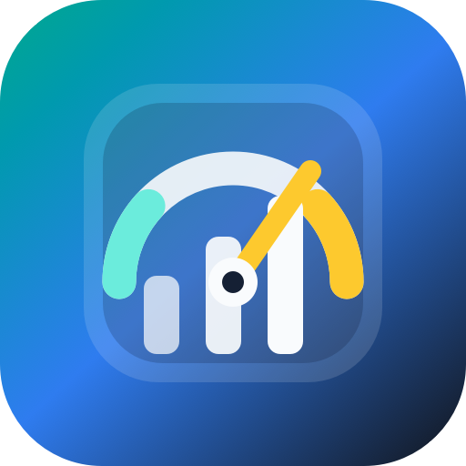
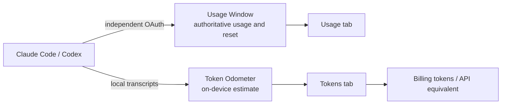

<a id="readme-top"></a>

<div align="center">
  

  <h1>TokenStats</h1>

  <p>Compress Coding Agent usage windows and local token flow into one glanceable, native status-area instrument panel.</p>

  <p>
    <a href="README.zh_cn.md">中文 README</a>
    ·
    <a href="apps/TokenStats/CONTEXT.md">Domain glossary</a>
    ·
    <a href="https://github.com/zhangchi0104/agent-sessions/releases">Download releases</a>
  </p>

  <p>
    <a href="https://github.com/zhangchi0104/agent-sessions/actions/workflows/test-tokenstats.yml"></a>
    <a href="https://github.com/zhangchi0104/agent-sessions/actions/workflows/test-tokenstats-windows.yml"></a>
    <a href="https://github.com/zhangchi0104/agent-sessions/releases"></a>
    <a href="https://github.com/zhangchi0104/agent-sessions/stargazers"></a>
    <a href="https://github.com/zhangchi0104/agent-sessions/commits/main"></a>
  </p>

  <p>
    
    
    
  </p>
</div>

> [!IMPORTANT]
> TokenStats intentionally exposes two separate readings: **Usage Windows** come from each Coding Agent's authoritative usage endpoint; the **Token Odometer** is estimated from local transcripts. The latter is not a quota, invoice, or remaining allowance.

## What problem does it solve?

Claude Code and Codex are powerful, but “how much of this usage window is left?” and “how many tokens did my recent work move?” usually require separate places to look. TokenStats answers both from a native menu-bar or notification-area surface.

| Reading | Source | What it shows |
| --- | --- | --- |
| **Usage Window** | The Coding Agent's authoritative usage endpoint | Consumed percentage, window name, reset time |
| **Token Odometer** | Local transcript files | Today / 7 days / 30 days, grouped by Agent → Model → Token Kind |
| **Billing tokens** | A fixed Token Odometer projection | direct input + cache write + output |
| **API equivalent** | Model-attributed public API list-price estimate | An estimate, not an invoice or subscription charge |

## Two data paths



The two sources never collapse into one ambiguous “total”: endpoint data answers “how much of the quota window is consumed,” while local files answer “how many tokens are present in the local record.”

## Native clients for two desktops

| Platform | Shell | Key capabilities | Distribution status |
| --- | --- | --- | --- |
| **macOS** | SwiftUI + AppKit menu-bar app | Usage / Tokens tabs, independent OAuth, Token Kind filters, API-equivalent amount, localization | Signed and notarized `.dmg` files are published through GitHub Releases |
| **Windows** | C# + WPF notification-area app | Usage / Tokens tabs, tray summary, appearance controls, transcript watcher, win-x64 / win-arm64 | CI publishes self-contained portable builds; installer and Authenticode signing remain release-engineering work |

The clients share product semantics while respecting macOS and Windows conventions for windows, status areas, accessibility, and themes.

### The four Token Kinds

The raw total is made from four disjoint dimensions so tokens are not counted twice:

```text
direct input + output + cache write + cache read
```

Each Token Kind can also act as a table display filter. The **selected total** changes only the table projection; it does not rewrite the raw Odometer or change the objective Billing tokens/API-equivalent summaries.

<details>
<summary>Expand: important data boundaries</summary>

- Codex `archived_sessions` is intentionally excluded from scanning; historical Odometer values can fall after active sessions are archived.
- Windows Billing tokens exclude cache reads, while API equivalent prices cache reads as cached input.
- Missing or unpriced Models make the API-equivalent estimate explicitly partial instead of inventing a complete amount.
- TokenStats does not read Claude Code's or Codex's own stored login credentials; each Coding Agent has an independent OAuth session and credential store.

</details>

## Install

### macOS

1. Open [GitHub Releases](https://github.com/zhangchi0104/agent-sessions/releases).
2. Download the latest `TokenStats-*.dmg`.
3. Drag `TokenStats.app` into Applications and launch it from the menu bar.
4. Sign in to the Claude Code or Codex accounts you want to monitor inside TokenStats.

macOS release artifacts are Developer ID signed and notarized by the release workflow. Debug and local Release builds use ad-hoc signing by default and do not require an Apple Developer account.

### Windows

Windows currently ships as source plus CI portable artifacts rather than a signed installer. The self-contained executable does not require a separate .NET installation, but an unsigned portable build may trigger SmartScreen.

## Develop locally

### macOS: SwiftUI + AppKit

Requirements: macOS 26 and Xcode 26.6. The project uses the Xcode 26 project format.

```sh
cd apps/TokenStats

# Static checks, app compilation, isolation checks, and unit tests.
# UI automation is not started by this command.
npm test

# Foreground UI automation: use an isolated macOS user, VM, or CI desktop.
npm run test:ui

# Build Debug and launch the menu-bar app.
npm run dev

# Build Release.
npm run build
```

If you need a local Apple Development Team, copy the ignored configuration template and enter your Team ID:

```sh
cp Config/Signing.local.xcconfig.example Config/Signing.local.xcconfig
```

Do not persist a personal Team through Xcode's **Signing & Capabilities → Team** picker: Xcode can write personal signing values back into the tracked `project.pbxproj`.

### Windows: C# + WPF

Requirements: Windows 10 version 1809 or newer, Windows 11, and the .NET 8 SDK.

```powershell
cd apps\TokenStats.Windows

# Restore, build, Core tests, and WPF UI smoke.
.\scripts\build.ps1

# Run locally.
dotnet run --project src\TokenStats.App\TokenStats.App.csproj

# Create portable builds.
.\scripts\publish.ps1 -Runtime win-x64
.\scripts\publish.ps1 -Runtime win-arm64
```

### Test entry points

| Command | Coverage |
| --- | --- |
| `cd apps/TokenStats && npm test` | Localization, signing isolation, release-toolchain checks, app compilation, Swift unit tests |
| `cd apps/TokenStats && npm run test:ui` | Foreground macOS UI automation; never implicit in default `npm test` |
| `cd apps/TokenStats.Windows && .\scripts\build.ps1 -Configuration Release` | .NET restore/build, Core console harness, WPF UI smoke |

## Repository map

```text
.
├── apps/
│   ├── TokenStats/                 # macOS SwiftUI + AppKit client
│   └── TokenStats.Windows/         # Windows C# + WPF client
├── docs/
│   ├── adr/                        # Architecture decision records
│   ├── goals/                      # Product goals
│   └── specs/                      # Working specifications
├── .github/workflows/              # macOS / Windows CI and macOS release
├── PRODUCT.md                      # Product boundaries and language principles
└── DESIGN.md                       # Native Instrument Panel design system
```

Recommended reading:

- [Product semantics and glossary](apps/TokenStats/CONTEXT.md)
- [Windows development and behavior](apps/TokenStats.Windows/README.md)
- [Architecture decisions](apps/TokenStats/docs/adr/)
- [Release pipeline](apps/TokenStats/docs/release.md)
- [Localization contract](apps/TokenStats/docs/localization.md)

## Languages

The app ships with English, Simplified Chinese, German, French, Japanese, and Russian. Language selection changes TokenStats-owned copy only; Model IDs, URLs, paths, JSON fields, and raw diagnostics remain invariant.

README editions:

- 中文：[README.zh_cn.md](README.zh_cn.md)，点击阅读
- English: current page

## CI and releases

- `main` is the stable channel and produces normal-version macOS DMG releases.
- `dev` is the beta channel and produces `-beta.N` pre-releases.
- macOS releases use semantic-release to derive versions from Conventional Commits, then sign, notarize, and upload a GitHub Release.
- Windows CI publishes unsigned portable artifacts for `win-x64` and `win-arm64`.
- UI automation runs on a dedicated macOS CI desktop; the default unit-test path does not take over a user's foreground desktop.

Use [Conventional Commits](https://www.conventionalcommits.org/), for example `feat(TokenStats): ...`, `fix(windows): ...`, or `docs: ...`.

## Contributing

Use [Issues](https://github.com/zhangchi0104/agent-sessions/issues) for bug reports and ideas. Before opening a pull request:

1. Read [CONTEXT.md](apps/TokenStats/CONTEXT.md) to preserve the Usage Window / Token Odometer boundary.
2. Run the platform-specific test entry points.
3. Include screenshots or a recording for UI changes and state which platform was actually verified.
4. Never commit OAuth tokens, signing credentials, local SQLite files, or build artifacts.

## GitHub project pulse

[](https://www.star-history.com/#zhangchi0104/agent-sessions&Date)

<div align="center">
  <sub>Made for developers who want a precise readout, not another dashboard.</sub>
  <br>
  <a href="#readme-top">Back to top</a>
</div>
