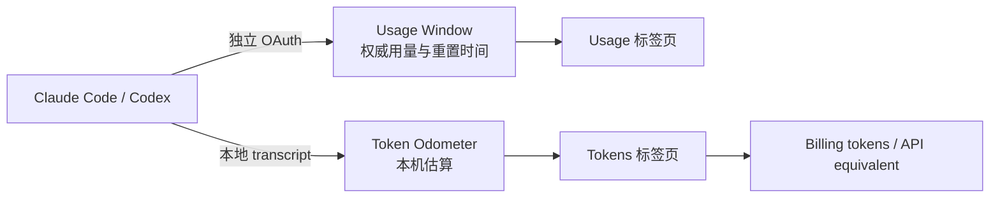

<a id="readme-top"></a>

<div align="center">
  

  <h1>TokenStats</h1>

  <p>把 Coding Agent 的用量窗口与本地 Token 流量，压缩成一眼能读懂的原生状态栏仪表台。</p>

  <p>
    <a href="README.md">English</a>
    ·
    <a href="apps/TokenStats/CONTEXT.md">术语与数据语义</a>
    ·
    <a href="https://github.com/zhangchi0104/agent-sessions/releases">下载 Releases</a>
  </p>

  <p>
    <a href="https://github.com/zhangchi0104/agent-sessions/actions/workflows/test-tokenstats.yml"></a>
    <a href="https://github.com/zhangchi0104/agent-sessions/actions/workflows/test-tokenstats-windows.yml"></a>
    <a href="https://github.com/zhangchi0104/agent-sessions/releases"></a>
    <a href="https://github.com/zhangchi0104/agent-sessions/stargazers"></a>
    <a href="https://github.com/zhangchi0104/agent-sessions/commits/main"></a>
  </p>

  <p>
    
    
    
  </p>
</div>

> [!IMPORTANT]
> TokenStats 同时展示两种刻意分开的读数：**Usage Window** 来自 Coding Agent 的权威用量接口；**Token Odometer** 来自本机 transcript 的 Token 估算。后者不是配额、账单或剩余额度。

## 它解决什么问题？

Claude Code 和 Codex 的工作流很强大，但“这一个用量窗口还剩多少”和“最近到底跑过多少 Token”往往需要分别寻找。TokenStats 把这两个问题放进一个原生状态区小面板：打开菜单栏或通知区域，就能看到当前状态。

| 读数 | 数据来源 | 你能看到什么 |
| --- | --- | --- |
| **Usage Window** | Coding Agent 自己的权威用量接口 | 已消耗百分比、窗口名称、重置时间 |
| **Token Odometer** | 本机 transcript 文件 | Today / 7 days / 30 days，按 Agent → Model → Token Kind 展开 |
| **Billing tokens** | Token Odometer 的固定投影 | direct input + cache write + output |
| **API equivalent** | 按 Model 与公开 API list price 估算 | 估算金额；不是发票，也不代表订阅实际扣费 |

## 两条数据链路



这两个来源永远不会被合并成一个模糊的“总用量”：接口数据回答“配额窗口用了多少”，本地文件回答“本机记录里流过多少 Token”。

## 原生双端体验

| 平台 | 形态 | 主要能力 | 当前分发状态 |
| --- | --- | --- | --- |
| **macOS** | SwiftUI + AppKit 菜单栏应用 | Usage / Tokens 双标签页、独立 OAuth、Token Kind 筛选、API 等值金额、多语言 | GitHub Releases 提供 codesigned + notarized `.dmg` |
| **Windows** | C# + WPF 通知区域应用 | Usage / Tokens 双标签页、系统托盘摘要、主题与外观、Token watcher、win-x64 / win-arm64 | CI 提供 self-contained portable 构建；安装器与 Authenticode 仍在 release engineering 中 |

两个客户端共享产品语义，但分别遵循 macOS 与 Windows 的窗口、状态区、无障碍和主题习惯，不强行套用同一套 UI。

### Token Odometer 的四种 Token Kind

原始总量由四个互斥维度组成，避免重复计数：

```text
direct input + output + cache write + cache read
```

其中每个 Token Kind 都可以作为表格显示筛选器。筛选出的 **selected total** 只改变表格投影，不会改写原始 Odometer，也不会改变 Billing tokens 或 API equivalent 的客观摘要。

<details>
<summary>展开：重要的数据边界</summary>

- Codex 的 `archived_sessions` 不在扫描范围内；归档活跃会话后，历史 Odometer 读数可能回落。
- Windows 的 Billing tokens 不包含 cache read，但 API equivalent 会按缓存输入价格估算 cache read。
- 缺失或未收录的 Model 会让 API equivalent 标记为 partial，而不是伪造完整金额。
- TokenStats 不读取 Claude Code 或 Codex 自己保存的登录凭据；每个 Coding Agent 使用独立的 OAuth 会话与凭据存储。

</details>

## 安装

### macOS

1. 前往 [GitHub Releases](https://github.com/zhangchi0104/agent-sessions/releases)。
2. 下载最新的 `TokenStats-*.dmg`。
3. 将 `TokenStats.app` 拖入 Applications，然后从菜单栏打开。
4. 在 TokenStats 内分别登录需要监测的 Claude Code 或 Codex 账户。

macOS 发布包由 release workflow 完成 Developer ID 签名与 Apple notarization。Debug 和本地 Release 构建默认使用 ad-hoc signing，不需要 Apple Developer 账号。

### Windows

Windows 当前以源码和 CI portable artifact 为主，尚未提供签名安装器。构建出的 self-contained executable 不要求终端用户额外安装 .NET，但未签名的 portable 程序可能触发 SmartScreen。

## 本地开发

### macOS：SwiftUI + AppKit

要求：macOS 26、Xcode 26.6（项目使用 Xcode 26 工程格式）。

```sh
cd apps/TokenStats

# 静态检查、应用编译、隔离检查与单元测试；不启动 UI 自动化
npm test

# 前台桌面 UI 自动化：只在隔离的 macOS 用户、虚拟机或专用 CI 桌面运行
npm run test:ui

# Debug 构建并启动菜单栏应用
npm run dev

# Release 构建
npm run build
```

如果需要本地 Apple Development Team，可以复制被 Git 忽略的配置模板并手动填写 Team ID：

```sh
cp Config/Signing.local.xcconfig.example Config/Signing.local.xcconfig
```

不要在 Xcode 的 **Signing & Capabilities → Team** 选择器中持久化个人 Team，否则 Xcode 可能把个人签名信息写回 tracked 的 `project.pbxproj`。

### Windows：C# + WPF

要求：Windows 10 version 1809 或更高版本、Windows 11、.NET 8 SDK。

```powershell
cd apps\TokenStats.Windows

# restore、build、Core 测试与 WPF UI smoke
.\scripts\build.ps1

# 本地启动
dotnet run --project src\TokenStats.App\TokenStats.App.csproj

# 生成 portable 构建
.\scripts\publish.ps1 -Runtime win-x64
.\scripts\publish.ps1 -Runtime win-arm64
```

### 测试入口

| 命令 | 内容 |
| --- | --- |
| `cd apps/TokenStats && npm test` | localization、签名隔离、Release toolchain、App 编译、Swift 单元测试 |
| `cd apps/TokenStats && npm run test:ui` | macOS 前台 UI 自动化；不会由默认 `npm test` 隐式执行 |
| `cd apps/TokenStats.Windows && .\scripts\build.ps1 -Configuration Release` | .NET restore/build、Core console harness、WPF UI smoke |

## 仓库结构

```text
.
├── apps/
│   ├── TokenStats/                 # macOS SwiftUI + AppKit 客户端
│   └── TokenStats.Windows/         # Windows C# + WPF 客户端
├── docs/
│   ├── adr/                        # 架构决策记录
│   ├── goals/                      # 当前产品目标
│   └── specs/                      # 工作规格
├── .github/workflows/              # macOS / Windows CI 与 macOS release
├── PRODUCT.md                      # 产品边界与术语原则
└── DESIGN.md                       # Native Instrument Panel 设计系统
```

推荐阅读：

- [产品语义与术语表](apps/TokenStats/CONTEXT.md)
- [Windows 开发与行为说明](apps/TokenStats.Windows/README.md)
- [架构决策记录](apps/TokenStats/docs/adr/)
- [发布流程](apps/TokenStats/docs/release.md)
- [本地化约定](apps/TokenStats/docs/localization.md)

## 多语言

应用内支持：English、简体中文、Deutsch、Français、日本語、Русский。语言切换只改变 TokenStats 自有文案；Model ID、URL、路径、JSON 字段和原始诊断信息保持不变。

README 提供：

- 简体中文：当前页面
- [English](README.md)

## 发布与 CI

- `main`：stable channel，发布正常版本的 macOS DMG。
- `dev`：beta channel，发布带 `-beta.N` 的 pre-release。
- macOS 发布使用 semantic-release，根据 Conventional Commits 计算版本，并完成签名、notarization 与 GitHub Release 上传。
- Windows CI 在 `win-x64` 与 `win-arm64` 上生成 portable unsigned artifacts。
- UI 自动化在独立的 macOS CI 桌面执行，默认单元测试不会占用用户前台桌面。

提交建议遵循 [Conventional Commits](https://www.conventionalcommits.org/)，例如 `feat(TokenStats): ...`、`fix(windows): ...`、`docs: ...`。

## 参与贡献

欢迎通过 [Issues](https://github.com/zhangchi0104/agent-sessions/issues) 报告问题或提出想法。提交前请：

1. 先阅读 [CONTEXT.md](apps/TokenStats/CONTEXT.md)，保持 Usage Window 与 Token Odometer 的语义边界。
2. 按平台运行对应的测试入口。
3. UI 改动附上截图或录屏，并说明实际验证的平台。
4. 不要提交 OAuth token、签名凭据、本地 SQLite 文件或构建产物。

## GitHub 项目动态

[](https://www.star-history.com/#zhangchi0104/agent-sessions&Date)

<div align="center">
  <sub>Made for developers who want a precise readout, not another dashboard.</sub>
  <br>
  <a href="#readme-top">返回顶部</a>
</div>
